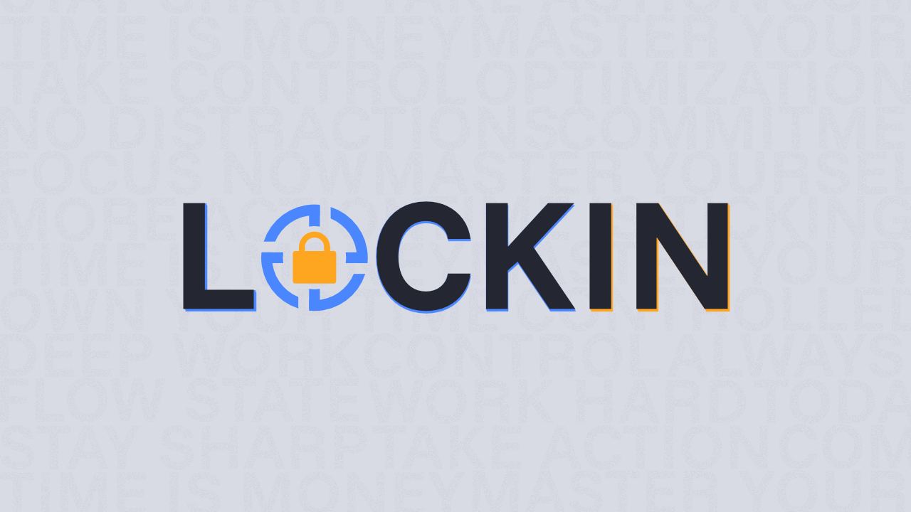

# Lock In - Distraction Manager

 
  
  
  
  
  
  
  
  

Lock In is a powerful and easy to use Chrome extension designed to help you stay focused by tracking and limiting time spent on problematic websites. Monitor your productivity, set daily limits, and build better browsing habits.

---

## 📋 Table of Contents

- [Features](#-features)
- [Installation](#-installation)
- [How to Use](#-how-to-use)
- [Settings Guide](#️-settings-guide)
- [Dashboard Overview](#-dashboard-overview)
- [Insights](#-insights)
- [FAQ](#-faq)
- [Privacy](#-privacy)
- [Contributing](#-contributing)

---

## ✨ Features

- **⏱️ Time Tracking** - Automatically tracks time spent on all/blocked websites
- **🚫 Website Blocking** - Block distracting websites with customizable time limits
- **📊 Smart Insights** - Focus score, streaks, and productivity analytics
- **⚠️ Website Actions** - Choose between various actions to stay focused
- **🎨 Multiple Themes** - Customize appearance with built-in color themes
- **💤 AFK Detection** - Customizable idle time detection to ensure accurate tracking
- **📈 Weekly Analytics** - Track your progress over time with detailed statistics

---

## 📥 Installation

### From Chrome Web Store (Coming Soon)

1. Visit the Chrome Web Store
2. Search for "Lock In - Distraction Blocker"
3. Click "Add to Chrome"

### Manual Installation (Developer Mode)

1. Download or clone this repository
2. Open Chrome and navigate to `chrome://extensions/`
3. Enable "Developer mode" in the top right
4. Click "Load unpacked"
5. Select the extension directory
6. The extension icon should appear in your toolbar

---

## 🚀 How to Use

### Quick Start

1. **Enable the Extension**
   - Click the Lock In icon in your toolbar
   - Ensure the "Extension Toggle" is ON

2. **Add Websites to your Block List**
   - Easily add websites when visiting them by clicking the button next to the toggle
   - You can also manually add them by typing the domain (e.g. youtube.com) or pasting your website under the Websites tab

3. **Set Your Daily Time Limit**
   - Go to Settings tab
   - Enable "Timer Active"
   - Set your desired time limit (Max 24 hours)

4. **Choose Block Action**
   - Select "Redirect" to auto navigate to your chosen website
   - Select "Block" to block content from being accessed (can be dismissed)
     - Optional Setting: Instant Purge: Blocked tab will be instantly deleted upon visiting
   - Select "Warn" to receive a dismissible warning

---

## ⚙️ Settings Guide

### **Dashboard Tab**

The Dashboard is where you can find all your relative website statistics.

#### **All Websites vs Blocked Websites**

- **All Websites**: View time spent across all websites
- **Blocked Websites**: View time spent only on sites in your block list

#### **Day Selector**

- Switch between days of the week to view historical data
- Today's data updates in real-time
- Previous days show saved data from your weekly history
- Only supports tracking up to one week

#### **Pie Chart & Website List**

- Visual breakdown of your time distribution
- Color-coded by time spent sorted by most to least time
- Sites under 1 minute are hidden but still counted in totals

#### **Insights**

- Click to view detailed productivity analytics
- See your Focus Score, streaks, and comparisons
- Get actionable recommendations for improvement

---

### **Websites Tab**

Manage your block list of distracting websites.

#### **Quick Add**

- Button appears when on a trackable website
- One-click to add current site to block list
- Grayed out if site is already added or not trackable

#### **Website Input Field**

- Manually type website domains to add
- Entering any link will be shortened to its domain
- Press Enter or click Add button

#### **Website List**

- View all blocked websites
- Click trash icon to remove a site
- Removal is instant and updates tracking immediately

#### **Important Notes**

- Removing a website clears its tracked time for that current day
- If you dismiss the block/warning it will be disabled for that tab only
- New tabs/windows must be reopened for blocks to take effect
- Chrome internal pages (chrome://, new tab) cannot be tracked

---

### **Settings Tab**

Configure how the extension behaves.

#### **Timer Settings**

- Set a daily time limit on blocked sites
  - Enabled: Daily time limit countdown is active
  - Disabled: performs action if action is not disabled
- Timer counts down only when on blocked sites
- Once time limit has been reached your action will trigger
  - Disabling or Enabling the timer does not disable the action

#### **Actions**

**Redirect Mode**

- Redirects to a website of your choice

**Block Mode**

- Completely blocks access to websites
- Shows a full-screen block message
- Requires 5-second hold to bypass (accountability feature)
- Recommended for maximum focus
- Optional Settings:
  - Instant Purge: Blocked tab will be instantly deleted upon visiting

**Warn Mode**

- Shows a dismissible warning in the top right corner
- You can close the warning and continue browsing
- Good for reminders without hard blocks

#### **AFK Detection**

**AFK Detection**

- **ON**: Pauses tracking after period of inactivity (no mouse/keyboard input)
- **OFF**: Continues tracking time even when idle
- Default time is 5 minutes with a range of 1 to 60
- Keep this ON for accurate tracking

---

## 📊 Dashboard Overview

### **Today's Usage**

- Total time spent on all tracked websites today
- Updates in real-time as you browse
- Displayed in the center of the pie chart

### **Weekly View**

- Select any day of the week to view past data
- Compare your habits across different days
- Data is preserved for the current week only

### **Color-Coded Visualization**

- Websites with more time appear in darker shades
- Blend between primary and secondary theme colors
- Instantly identify your biggest time sinks

---

## 💡 Insights

Access detailed analytics by clicking "View Insights" on the Dashboard.

### **Focus Score** (0-100)

Your overall productivity rating based on:

- **Blocked Site Usage** (40% weight) - Lower is better
- **Time vs Daily Average** (30% weight) - Consistency matters
- **Improvement from Yesterday** (20% weight) - Trending down is good
- **Other factors** (10% weight) - Streaks and goals

**Score Ranges:**

- 80-100: Excellent ⭐
- 60-79: Good 👍
- 40-59: Fair 😐
- 0-39: Needs Work 📉

### **Streak Counter** 🔥

- Tracks consecutive days with Focus Score > 75
- Breaks if you miss a day or score below 75
- Great for building long-term habits
- Displayed next to your Focus Score

### **Statistics Breakdown**

**Column 1: Focus Score**

- Current focus score and rating
- Active streak count

**Column 2: Blocked Time**

- Time spent on blocked sites today
- Percentage of total time
- Weekly blocked time total

**Column 3: Comparisons**

- % change from yesterday
- Difference from daily average
- Shows if you're improving

**Column 4: Best Performance**

- Your best day this week
- Daily average across the week
- Goals to beat

### **Interpreting Your Data**

**Time Spent From Yesterday**

- Positive %: You spent less time today ✅
- Negative %: You spent more time today ❌

**Blocked Time From Yesterday**

- Positive %: Less time on distractions ✅
- Negative %: More time on distractions ❌

**Focus Score From Yesterday**

- Positive: Your score improved ✅
- Negative: Your score declined ❌

**Diff From Average**

- Negative time: Below your average ✅
- Positive time: Above your average ❌

---

## ❓ FAQ

**Q: Why isn't a website being tracked?**  
A: Some pages can't be tracked:

- Chrome internal pages (chrome://, edge://)
- Chrome Web Store
- Extension management pages
- New Tab page
- Local HTML files (file://)

**Q: I added a website but it's not blocking. Why?**  
A: Make sure:

1. Extension toggle is ON (green lock icon)
2. Timer is Active in Settings
3. You've used all your daily time (or Warn mode is showing)
4. You've reloaded the website tab after adding it
5. The domain is typed correctly (e.g., `youtube.com` not `www.youtube.com`)

**Q: Can I block subdomains separately?**  
A: No. Blocking `example.com` blocks all subdomains (`www.example.com`, `blog.example.com`, etc.). This is by design to prevent easy bypasses.

**Q: How accurate is the time tracking?**  
A: Very accurate. Time is recorded every 30 seconds while a tab is active and focused and is recorded on each tab update. Testing shows on average millisecond differences which is negligible.

**Q: Does Lock In track time when Chrome is minimized?**  
A: Yes, if the Chrome window is minimized, time continues to count. There is a certain point where it stops counting if the tab is minimized for too long.

**Q: Where is my data stored?**  
A: All data is stored locally in Chrome's storage API:

- **Sync Storage**: Settings, website block list, timer config
- **Local Storage**: Daily time data, weekly history, insights

Nothing is sent to external servers.

**Q: Can I export my data?**  
A: No plans to do this currently, unless there is a demand.

---

### Feature Requests

**Q: Can you add feature X?**  
A: Maybe depending on demand, Submit features here:

- GitHub Issues
- Chrome Web Store reviews

---

## 🔐 Privacy

Lock In is designed with privacy as a top priority:

- ✅ **No data collection** - We don't collect any user data
- ✅ **No external servers** - All data stays on your device
- ✅ **No analytics** - We don't track how you use the extension
- ✅ **No ads** - Never have, never will
- ✅ **Open source** - Code is available for review

### Permissions Explained

Lock In requires these Chrome permissions:

- **storage** - Save your settings and time tracking data locally
- **tabs** - Detect which website you're on to track time
- **activeTab** - Know when you switch tabs to commit time accurately
- **alarms** - Schedule 30-second intervals for time tracking
- **scripting** - Inject block screens on restricted websites
- **idle** - Detect when you're AFK to pause tracking
- **host_permissions: <all_urls>** - Track time on any website you visit

These permissions are necessary for core functionality and are not used for any other purpose.

---

## 🤝 Contributing

**This is a solo developed passion project. There might be bugs and issues with updates.**

If you have an issue or your an experienced developer here is how you can make contributions:

### Reporting Bugs

1. Check existing issues to avoid duplicates
2. Include Chrome version, OS, and extension version
3. Provide steps to reproduce the bug
4. Include console errors if applicable

### Suggesting Features

1. Check if it's already been suggested
2. Explain the use case and benefits
3. Consider how it fits with existing features

### Pull Requests

1. Fork the repository
2. Create a feature branch
3. Follow existing code style
4. Test thoroughly before submitting
5. Update documentation if needed

---

## 💖 Support

If Lock In helps you stay focused, consider:

- <a href="https://ko-fi.com/alexprograms" target="_blank">Donating</a>, anything is appreciated!
- ⭐ Starring the project on GitHub
- 📝 Leaving a review on the Chrome Web Store
- 🐛 Reporting bugs to help improve the extension
- 💬 Sharing with friends who need better focus
